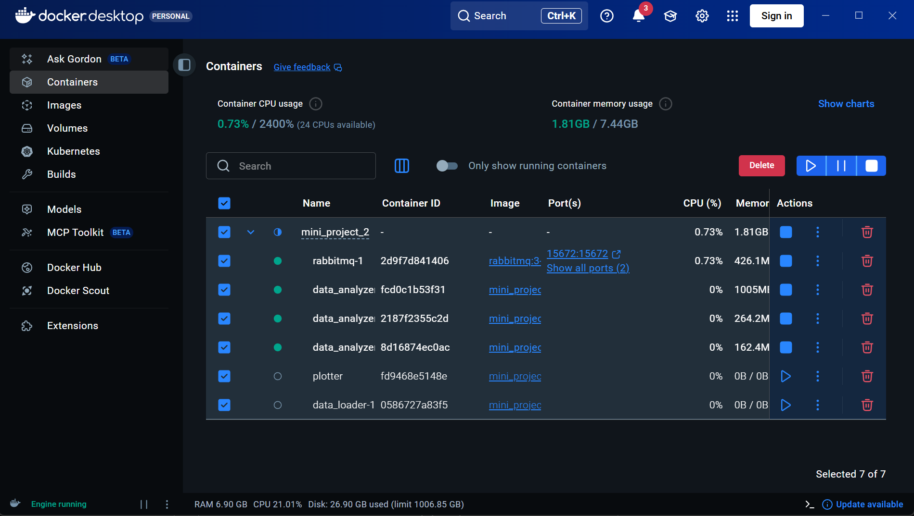
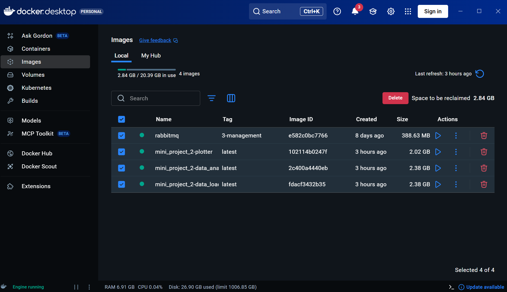

## Pre-requisites

You will need to have installed Docker Desktop :
https://www.docker.com/products/docker-desktop/

## Configuring the application and scaling
To run the application enter the following command in terminal
Change `data_analyzer=` for scaling
```
docker-compose up --build --scale data_analyzer=3
```


## Closing the application
For now, manually stop container and delete the local image before next run.




